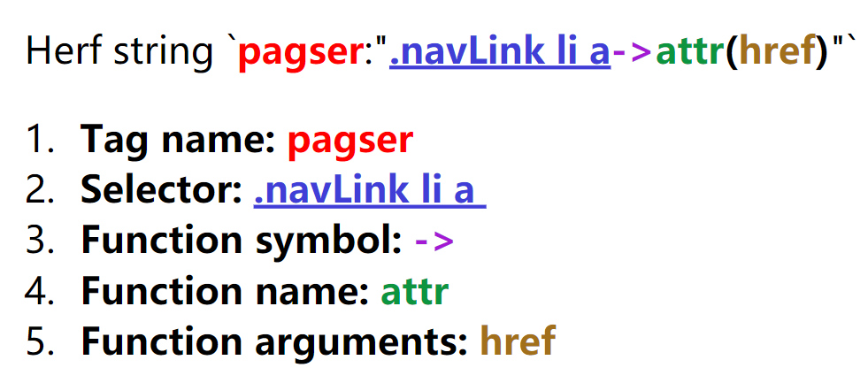

# Pagser

**Pagser** inspired by  <u>**pag**</u>e par<u>**ser**</u>。

**Pagser** is an simple, easy, extensible, configurable HTML page parser to struct based on [goquery](https://github.com/PuerkitoBio/goquery) and struct tags, It's parser library from [scrago](https://github.com/foolin/scrago).

## Features

* **Simple** - Use golang struct tag syntax.
* **Easy** - Easy use for your spider/crawler/colly application.
* **Extensible** - Support for extension functions.
* **Struct tag grammar** - Grammar is simple, like \`pagser:"a->attr(href)"\`.
* **Nested Structure** - Support Nested Structure for node.
* **Configurable** - Support configuration.
* **GoQuery/Colly** - Support all [goquery](https://github.com/PuerkitoBio/goquery) project, such as [go-colly](https://github.com/gocolly/colly).

## Install

```bash
go get github.com/foolin/pagser
```

## Docs

See [Pagser](https://pkg.go.dev/github.com/foolin/pagser)


# Usage

```go

package main

import (
	"encoding/json"
	"fmt"
	"github.com/foolin/pagser"
)

const rawPageHtml = `
<!doctype html>
<html>
<head>
    <meta charset="utf-8">
    <title>Pagser Title</title>
</head>

<body>
	<h1>H1 Pagser Example</h1>
	<div class="navlink">
		<div class="container">
			<ul class="clearfix">
				<li id=''><a href="/">Index</a></li>
				<li id='2'><a href="/list/web" title="web site">Web page</a></li>
				<li id='3'><a href="/list/pc" title="pc page">Pc Page</a></li>
				<li id='4'><a href="/list/mobile" title="mobile page">Mobile Page</a></li>
			</ul>
		</div>
	</div>
</body>
</html>
`

type ExampPage struct {
	Title string `pagser:"title"`
	H1    string `pagser:"h1"`
	Navs  []struct {
		ID   int    `pagser:"->attrInt(id, -1)"`
		Name string `pagser:"a->attr(href)"`
		Url  string `pagser:"a"`
	} `pagser:".navlink li"`
}

func main() {
	//New default config
	p := pagser.New()

	//data parser model
	var page ExampPage

	//parse html data
	err := p.Parse(&page, rawPageHtml)

	//check error
	if err != nil {
		panic(err)
	}

	//print data
	fmt.Printf("Page data json: \n-------------\n%v\n-------------\n", toJson(page))
}

func toJson(v interface{}) string {
	data, _ := json.MarshalIndent(v, "", "\t")
	return string(data)
}

```

Run output:
```

Page data json: 
-------------
{
	"Title": "Pagser Title",
	"H1": "H1 Pagser Example",
	"Navs": [
		{
			"ID": -1,
			"Name": "/",
			"Url": "Index"
		},
		{
			"ID": 2,
			"Name": "/list/web",
			"Url": "Web page"
		},
		{
			"ID": 3,
			"Name": "/list/pc",
			"Url": "Pc Page"
		},
		{
			"ID": 4,
			"Name": "/list/mobile",
			"Url": "Mobile Page"
		}
	]
}
-------------

```

# Configuration

```go

type Config struct {
	TagerName    string //struct tag name, default is `pagser`
	FuncSymbol   string //Function symbol, default is `->`
	IgnoreSymbol string //Ignore symbol, default is `-`
	Debug        bool   //Debug mode, debug will print some log, default is `false`
}

```


# Struct tag grammar

```
[goquery selector]->[function]
```
Example:
```go

type ExamData struct {
	Herf string `pagser:".navLink li a->attr(href)"`
}
```

> 1.Struct tag name: `pagser`  
> 2.[goquery](https://github.com/PuerkitoBio/goquery) selector: `.navLink li a`   
> 3.Function symbol: `->`  
> 4.Function name: `attr`  
> 5.Function arguments: `href` 



# Functions

#### Builtin functions
- html()
- text()
- attr(name)
- attrInt(name, defaultValue) //covert attr value to int
- outerHtml()
- value(name) //alias for `goquery.AttrOr("value", "")`

#### Extensions functions
- Markdown() //convert html to markdown format.
- UgcHtml() //sanitize html

Extensions function need register, like:
```go
import "github.com/foolin/pagser/extensions/markdown"

p := pagser.New()

//Register Markdown
markdown.Register(p)

```

#### Write my function

**Function interface**
```go

type CallFunc func(node *goquery.Selection, args ...string) (out interface{}, err error)

```

**1. Write global function:**
```go

//global function need call pagser.RegisterFunc("myAttrInt", myAttrInt) before use it.
func myAttrInt(node *goquery.Selection, args ...string) (out interface{}, err error) {
	if len(args) < 2 {
		return "", fmt.Errorf("attrInt(name,defaultValue) must has name and default value, eg: attrInt(id,-1)")
	}
	name := args[0]
	defaultValue := args[1]
	attrVal := node.AttrOr(name, defaultValue)
	outVal, err := strconv.Atoi(attrVal)
	if err != nil {
		return strconv.Atoi(defaultValue)
	}
	return outVal, nil
}

type MyStruct struct{
  Attr int    `pagser:"->myAttrInt(id, -1)"`
}

func main(){

	p := pagser.New()

	//Register AttrInt
	p.RegisterFunc("myAttrInt", myAttrInt)

    //Todo

	//data parser model
	var page MyStruct
	//parse html data
	err := p.Parse(&page, rawPageHtml)

    //...
}

```


**2. Write struct function:**
```go

type MyStruct struct{
  Attr int    `pagser:"->myAttrInt(id, -1)"`
}

//Struct function not need register.
func (s MyStruct) myAttrInt(node *goquery.Selection, args ...string) (out interface{}, err error) {
	if len(args) < 2 {
		return "", fmt.Errorf("attrInt(name,defaultValue) must has name and default value, eg: attrInt(id,-1)")
	}
	name := args[0]
	defaultValue := args[1]
	attrVal := node.AttrOr(name, defaultValue)
	outVal, err := strconv.At
oi(attrVal)
	if err != nil {
		return strconv.Atoi(defaultValue)
	}
	return outVal, nil
}


func main(){

	p := pagser.New()

    //Todo

	//data parser model
	var page MyStruct
	//parse html data
	err := p.Parse(&page, rawPageHtml)

    //...
}

```

# Colly Example

Work with colly:
```go

p := pagser.New()


// On every a element which has href attribute call callback
collector.OnHTML("body", func(e *colly.HTMLElement) {
	//data parser model
	var page MyStruct
	//parse html data
	err := p.ParseSelection(&page, e.Dom)

})

```

# Example

[See Examples](https://github.com/foolin/pagser/tree/master/_examples)

# Dependences
- github.com/PuerkitoBio/goquery
- github.com/spf13/cast
- github.com/mattn/godown
- github.com/microcosm-cc/bluemonday


